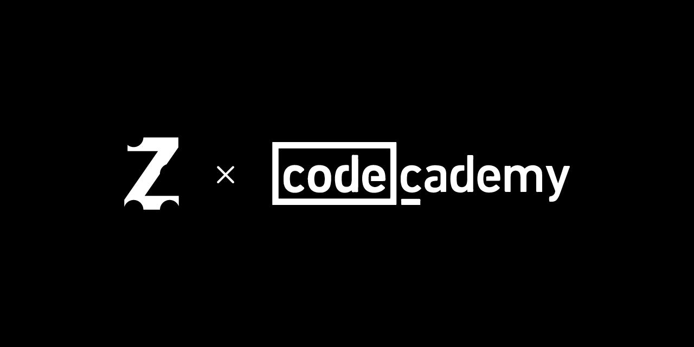

# CodeAcademy personal projects

# Actually learning...
**Python3**
- Hello World
- Control Flow
- Lists
- Loops
- **Functions (actually working on...)**
- *Code Challenges*
- *Strings*
- *Modules*
- *Dictionaries*
- *Files*
- *Classes*
- *Code Challenges II*
